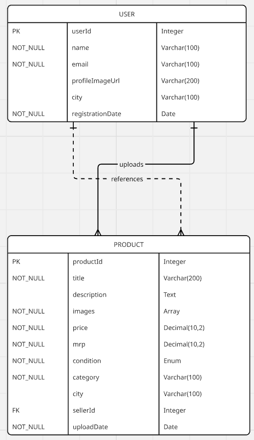

# 🛒 Bazaar - Android Marketplace App

A modern Android marketplace application built with Jetpack Compose that allows users to buy and sell products in a local marketplace environment.

## Demo
<table>
  <tr>
    <td align="center">
      <strong>ER-Diagram</strong><br>
      
    </td>
    <td align="center">
      <strong>🎥 Video</strong><br>
      
    </td>
  </tr>
</table>

## 📱 Features

### 🔐 Authentication
- Email/Password login and registration
- Firebase Authentication integration
- Secure user session management

### 🛍️ Product Management
- **Browse Products**: View all available products in a grid layout
- **Product Details**: Detailed product information with image gallery
- **Create Listings**: Upload products with multiple images
- **My Uploads**: Manage your own product listings
- **Categories**: Organized product categories (Electronics, Clothing, Furniture, Vehicles, Books, Sports, etc.)

### 🏪 Marketplace Features
- **Product Search & Discovery**: Browse products by category
- **Location-based**: Products include city information
- **Price Comparison**: MRP vs Asking Price display
- **Product Condition**: New, Used, Refurbished options
- **Image Upload**: Multiple product images with cover image selection

### 🎨 User Experience
- **Modern UI**: Built with Material Design 3
- **Pull-to-Refresh**: Swipe to refresh product listings
- **Responsive Design**: Optimized for various screen sizes
- **Loading States**: Smooth loading indicators and error handling

## 🛠️ Tech Stack

### Frontend
- **Jetpack Compose**: Modern declarative UI toolkit
- **Material Design 3**: Latest Material Design components
- **Navigation Compose**: Type-safe navigation
- **Lifecycle ViewModel**: State management
- **Coil**: Image loading and caching

### Backend & Cloud
- **Firebase Authentication**: User authentication
- **Cloud Firestore**: NoSQL database for products and user data
- **Firebase Storage**: Image storage and retrieval
- **Google Services**: Firebase integration

### Architecture & Patterns
- **Clean Architecture**: Separation of concerns with domain, data, and UI layers
- **MVVM Pattern**: Model-View-ViewModel architecture
- **Repository Pattern**: Data abstraction layer
- **Dependency Injection**: Koin for DI
- **Coroutines**: Asynchronous programming

### Libraries & Dependencies
- **Koin**: Dependency injection framework
- **Accompanist**: Compose utilities (SwipeRefresh)
- **Kotlin Coroutines**: Asynchronous programming
- **StateFlow/LiveData**: Reactive state management

## 📁 Project Structure

```
app/src/main/java/com/ayaan/bazaar/
├── BazaarApplication.kt          # Application class
├── MainActivity.kt               # Main activity
├── data/                         # Data layer
│   └── firebase/                 # Firebase implementations
├── di/                          # Dependency injection
├── domain/                      # Domain layer
│   ├── model/                   # Data models
│   └── repository/              # Repository interfaces
├── ui/                          # UI layer
│   ├── auth/                    # Authentication screens
│   ├── common/                  # Reusable UI components
│   ├── navigation/              # Navigation setup
│   ├── product/                 # Product-related screens
│   │   ├── createproduct/       # Create product screen
│   │   ├── myuploads/          # User's uploads screen
│   │   ├── productdetails/     # Product details screen
│   │   └── productlist/        # Product list screen
│   └── theme/                   # App theming
└── util/                        # Utility classes
```

## 🚀 Getting Started

### Prerequisites
- Android Studio Hedgehog or later
- Android SDK (API level 28+)
- Firebase project setup
- Google Services configuration

### Setup Instructions

1. **Clone the repository**
   ```bash
   git clone <repository-url>
   cd Bazaar
   ```

2. **Firebase Setup**
   - Create a new Firebase project
   - Enable Authentication (Email/Password)
   - Create a Firestore database
   - Enable Firebase Storage
   - Download `google-services.json` and place it in the `app/` directory

3. **Build and Run**
   ```bash
   ./gradlew assembleDebug
   ```

### Firebase Configuration

Ensure your Firebase project has:
- **Authentication**: Email/Password provider enabled
- **Firestore**: Database rules configured for read/write access
- **Storage**: Rules configured for image uploads

## 📋 App Configuration

- **Package Name**: `com.ayaan.bazaar`
- **Min SDK**: 28 (Android 9.0)
- **Target SDK**: 36
- **Compile SDK**: 36

## 🏗️ Build Variants

- **Debug**: Development build with debugging enabled
- **Release**: Production build with optimizations

## 📄 License

This project is developed for educational/portfolio purposes.

## 👨‍💻 Developer

**Ayaan** - Android Developer

---

*Built using Jetpack Compose and Firebase*
# E-commerce
